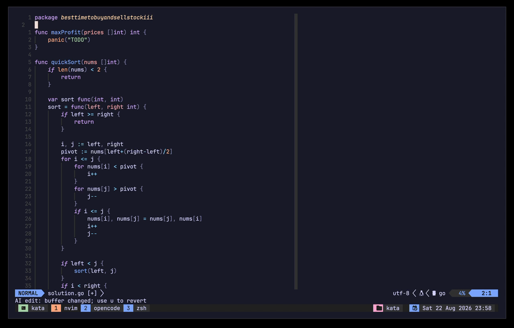

# ai-edit.nvim

Apply focused AI edits to a Neovim buffer or visual selection through OpenCode. AI edit stages only the requested text, runs asynchronously, locks the target while work is active, and leaves a successful result unsaved and undoable with one `u`.

## Demo

[](https://github.com/user-attachments/assets/14ae0b69-2acf-4879-be1d-93a92c5b7d1a)

## Requirements

- Neovim 0.11 or newer.
- macOS or Linux. Windows is unsupported.
- Stable OpenCode `>=1.18.21 <2.0.0` available as `opencode` or through `command`.
- Configured OpenCode provider, model, and credentials.
- Network access on first use of each OpenCode version. AI edit installs the exact matching `@opencode-ai/plugin` into a private verified cache.
- A trusted worktree. Project reads are not an operating-system sandbox.

Bun and StyLua are contributor tools, not user runtime requirements. OpenCode runs the bundled TypeScript helper.

## Install

### lazy.nvim

```lua
{
  'vichr-vita/ai-edit.nvim',
  main = 'ai_edit',
  opts = {},
}
```

### Other package managers

Add this repository root to Neovim's `runtimepath`, then call:

```lua
require('ai_edit').setup({})
```

AI edit has no Neovim plugin dependency and does not install mappings until `setup()` runs.

## Configuration

```lua
require('ai_edit').setup {
  keymap = '<leader>ai',
  command = 'opencode',
  model = false,
  variant = false,
  timeout_ms = 5 * 60 * 1000,
  cleanup_timeout_ms = 2000,
  max_bytes = 1024 * 1024,
  width = 0.5,
  height = 0.2,
  status = {
    text = 'AI is Working...',
    color = '#d946ef',
    interval_ms = 80,
    frames = { '⠋', '⠙', '⠹', '⠸', '⠼', '⠴', '⠦', '⠧', '⠇', '⠏' },
  },
}
```

| Option | Type and default | Constraint |
| --- | --- | --- |
| `keymap` | string, `'<leader>ai'` | Non-empty global normal and visual mapping. |
| `command` | string, `'opencode'` | Non-empty executable name or path, without shell arguments. |
| `model` | string or `false`, `false` | `provider/model`; `false` inherits resolved OpenCode configuration. |
| `variant` | string or `false`, `false` | Non-empty and requires an explicit `model`. |
| `timeout_ms` | integer, `300000` | Positive; covers preflight, bootstrap, and model run. |
| `cleanup_timeout_ms` | integer, `2000` | Positive; bounds deletion of each observed OpenCode session. |
| `max_bytes` | integer, `1048576` | Positive; the full in-memory buffer must fit, including selection edits. |
| `width` | number, `0.5` | Greater than `0` and at most `1`; fraction of editor width. |
| `height` | number, `0.2` | Greater than `0` and at most `1`; fraction of usable editor height. |
| `status.text` | string, `'AI is Working...'` | Non-empty. |
| `status.color` | string, `'#d946ef'` | Six-digit hex color. |
| `status.interval_ms` | integer, `80` | Positive animation interval. |
| `status.frames` | list, 10-frame Braille spinner | Non-empty list of non-empty strings. |

Unknown options, invalid values, and a `variant` without `model` fail before an edit starts. Repeated setup replaces package mappings, command, and autocommands. Active jobs keep their captured process, timeout, lock, and cleanup settings.

## Use

- Normal mode: press configured `keymap` to target the whole in-memory buffer.
- Characterwise or linewise visual mode: press configured `keymap` to target only the exact selection while providing the full buffer as read-only context.
- Blockwise selections are rejected.

Prompt keys:

| Key | Action |
| --- | --- |
| `<CR>` | Submit non-empty instruction. |
| `<C-j>` | Insert newline. |
| `<C-p>` / `<C-n>` | Recall older/newer session instruction. |
| `<Up>` / `<Down>` | Navigate history at first/last input line; otherwise move normally. |
| `<Esc>` | Close prompt without starting OpenCode. |

History keeps the newest 100 accepted instructions in memory for the current Neovim process. It preserves multiline text and is never written to disk.

Run `:AIEditCancel` in the target buffer, or call `require('ai_edit').cancel([bufnr])`, to stop active work. Cancellation removes staging data and leaves target text unchanged.

## Statusline

`statusline()` returns an escaped animated indicator while any edit runs and `''` while idle. `statusline_color()` returns a lualine-compatible color table.

```lua
require('lualine').setup {
  sections = {
    lualine_x = {
      {
        require('ai_edit').statusline,
        color = require('ai_edit').statusline_color,
      },
    },
  },
}
```

Load lualine after `vichr-vita/ai-edit.nvim` when using direct function references.

## Health

Run:

```vim
:checkhealth ai_edit
```

Health checks Neovim, operating system, executable discovery, and OpenCode version by executing only `<command> --version`. It does not resolve OpenCode extensions, inspect credentials, load tools, contact a model, create a session, or write cache content. Provider, network, and worktree trust remain user confirmations. Every edit performs authoritative version and configuration preflight again.

## Security

AI edit exposes project `read`, `glob`, and `grep` plus one audited staging tool. It disables project OpenCode configuration, external configured plugins, custom provider `npm` packages, MCP servers, sharing, snapshots, formatters, LSP servers, shell access, stock mutation tools, and unrelated agent tools. The stable OpenCode `1.x` boundary still trusts that release's inseparable bundled provider/auth plugins.

This is not an operating-system sandbox. OpenCode can read the trusted project, and an in-project symlink can expose files outside it. Do not run AI edit in an untrusted worktree.

Staging directories use private Unix permissions. Whole-buffer runs stage current in-memory text; selection runs also stage a read-only full-buffer context. The model cannot choose a destination path. Results apply only after successful validated submission and only when the target buffer still matches its captured revision.

## Data lifecycle

- Successful results stay modified and unsaved in Neovim. Press `u` once to restore pre-edit text.
- Target buffers remain locked while work runs. Other buffers remain usable.
- Prompt and activity buffers disable swap. Activity output is bounded and redacts staging paths and session IDs.
- Private staging data is removed after success, failure, cancellation, or timeout.
- Verified helper caches persist under `stdpath('cache')/nvim-ai-edit` and are separated by OpenCode version, helper source, and executable identity.
- AI edit attempts bounded deletion of observed OpenCode sessions. A crash, unobserved session, OpenCode log, or failed cleanup can leave remote/local data outside plugin control.
- OpenCode, model providers, and authentication services apply their own logging and retention policies.

Remove helper cache content only when no edit is active. It will be rebuilt with network access on next use.

## Troubleshooting

| Symptom | Check |
| --- | --- |
| `ai_edit:` setup error | Fix named option type, range, or unknown key before retrying. |
| Executable not found | Run `:checkhealth ai_edit`; set `command` to an executable path. |
| Unsupported version | Install stable OpenCode `>=1.18.21 <2.0.0`; prereleases and `2.x` are unsupported. |
| Model/provider unavailable or authentication fails | Configure provider, model, and credentials in OpenCode, then verify OpenCode directly. |
| Helper bootstrap fails | Restore network access; ensure OpenCode can install exact matching `@opencode-ai/plugin`. Do not weaken cache permissions. |
| Unsafe configuration | Disable reported sharing, snapshot, formatter, LSP, MCP, plugin, or mutation setting. |
| Prompt does not open | Use a named writable non-binary file, reduce buffer size, or provide more editor space around cursor. |
| Stale result | Do not mutate, rename, unload, or delete target while edit runs; retry from current text. |
| Timeout | Increase `timeout_ms` or reduce request scope. Target remains unchanged. |
| Session cleanup warning | Edit result is unaffected. Inspect OpenCode sessions/logs and remove retained data through OpenCode. |

## Development

Required checks:

```sh
bun tests/ai_edit/run.ts all
```

Installed baseline boundary only:

```sh
bun tests/ai_edit/run.ts opencode
```

Credentialed smoke is optional and may incur provider cost:

```sh
AI_EDIT_RUN_OAUTH_SMOKE=1 bun tests/ai_edit/run.ts oauth
```

See [CONTRIBUTING.md](CONTRIBUTING.md) for tool versions, test groups, and release gates.

## Compatibility

Supported: Neovim 0.11+ on macOS and Linux with stable OpenCode `>=1.18.21 <2.0.0`. CI covers Neovim 0.11 and current stable on Linux, plus current stable on macOS, against baseline OpenCode 1.18.21. Higher compatible CLI versions use an exact matching helper SDK and are covered by fake regressions. Windows, OpenCode prereleases, OpenCode below 1.18.21, and OpenCode 2.x are unsupported.

## License

[MIT](LICENSE)
