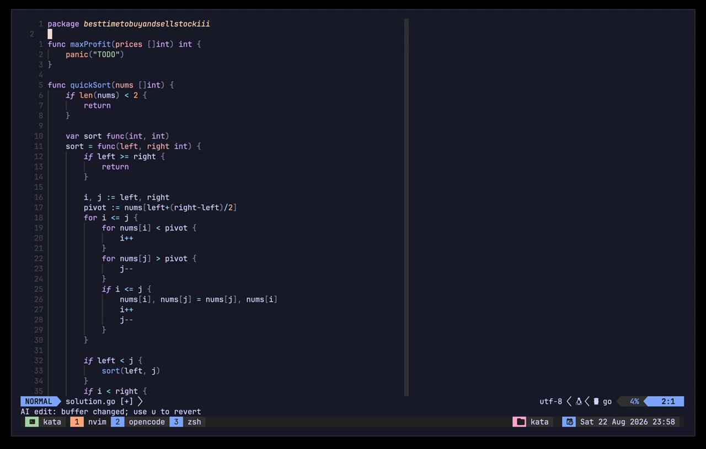

# ai-edit.nvim

Apply focused AI edits to a Neovim buffer or visual selection through headless [Pi](https://github.com/earendil-works/pi/tree/main/packages/coding-agent). Each edit uses one code-only prompt and an attached snapshot of the current buffer. Successful results stay unsaved and undoable with one `u`.

## Demo

[](https://github.com/user-attachments/assets/14ae0b69-2acf-4879-be1d-93a92c5b7d1a)

## Requirements

- Neovim 0.11 or newer on macOS or Linux.
- A current Pi CLI supporting the [headless and resource-isolation flags](https://github.com/earendil-works/pi/blob/main/packages/coding-agent/docs/cli.md), available as `pi` or through `command`.
- A model and provider credentials configured for AI edit.

Install Pi:

```sh
npm install -g --ignore-scripts @earendil-works/pi-coding-agent
```

## Install

With lazy.nvim:

```lua
{
  'vichr-vita/ai-edit.nvim',
  main = 'ai_edit',
  opts = {},
}
```

With another package manager, add the repository root to Neovim's `runtimepath`, then call `require('ai_edit').setup({})`. Mappings are installed only when `setup()` runs.

## Configure Pi

AI edit uses a dedicated configuration directory at `stdpath('config') .. '/ai-edit/pi'`, normally `~/.config/nvim/ai-edit/pi`. Set `config_dir` to change it. It does not inherit your regular Pi settings or project configuration.

For subscription authentication, start Pi separately with this directory, run `/login`, and choose and save a model with `/model`:

```sh
PI_CODING_AGENT_DIR="$HOME/.config/nvim/ai-edit/pi" pi
```

For API-key authentication, export your provider's API key before starting Neovim and set `model` in the plugin configuration. For example:

```lua
require('ai_edit').setup {
  model = 'anthropic/claude-sonnet-4-6',
}
```

AI edit reads only `defaultProvider` and `defaultModel` from this directory's `settings.json`. It links `auth.json` and `models.json` into the private configuration for each run, so Pi can refresh saved OAuth credentials in the dedicated directory. Configure [custom models](https://github.com/earendil-works/pi/blob/main/packages/coding-agent/docs/models.md) there if needed.

## Configuration

```lua
require('ai_edit').setup {
  keymap = '<leader>ai',
  command = 'pi',
  config_dir = vim.fn.stdpath('config') .. '/ai-edit/pi',
  model = false,
  thinking = 'off',
  timeout_ms = 5 * 60 * 1000,
  max_bytes = 1024 * 1024,
  width = 0.5,
  height = 0.2,
  status = {
    text = 'AI is Working...',
    color = '#d946ef',
    interval_ms = 80,
    frames = { '⠋', '⠙', '⠹', '⠸', '⠼', '⠴', '⠦', '⠧', '⠇', '⠏' },
  },
}
```

| Option | Default | Meaning |
| --- | --- | --- |
| `keymap` | `'<leader>ai'` | Non-empty normal and visual mapping. |
| `command` | `'pi'` | Executable name or path, without shell arguments. |
| `config_dir` | `stdpath('config') .. '/ai-edit/pi'` | Dedicated Pi model and authentication configuration. |
| `model` | `false` | `provider/model`; `false` uses the dedicated Pi defaults. |
| `thinking` | `'off'` | `off`, `minimal`, `low`, `medium`, `high`, `xhigh`, or `max`. Pi clamps this to the model's capabilities. |
| `timeout_ms` | `300000` | Positive integer; maximum duration of a run. |
| `max_bytes` | `1048576` | Positive integer; maximum buffer and replacement size. |
| `width` / `height` | `0.5` / `0.2` | Prompt size as fractions of the editor, greater than `0` and at most `1`. |
| `status.text` | `'AI is Working...'` | Non-empty statusline text. |
| `status.color` | `'#d946ef'` | Six-digit hex color. |
| `status.interval_ms` | `80` | Positive integer animation interval. |
| `status.frames` | Braille spinner | Non-empty list of non-empty strings. |

Unknown options and invalid values fail during setup. The OpenCode options `variant` and `cleanup_timeout_ms` have been removed. Use `thinking` for Pi's reasoning level.

## Use

Press the configured mapping in normal mode to edit the whole in-memory buffer. In characterwise or linewise visual mode, only the exact selection is replaced, with the same buffer supplied as context. Blockwise selections are unsupported.

| Prompt key | Action |
| --- | --- |
| `<CR>` | Submit a non-empty instruction. |
| `<C-j>` | Insert a newline. |
| `<C-p>` / `<C-n>` | Recall an older or newer instruction. |
| `<Up>` / `<Down>` | Navigate history at the first or last input line. |
| `<Esc>` | Close the prompt. |

History keeps the newest 100 accepted instructions in memory. Run `:AIEditCancel` in the target buffer, or call `require('ai_edit').cancel([bufnr])`, to cancel. Cancellation, timeout, and failed or incomplete responses leave the target text unchanged.

The target stays locked while Pi runs. Other buffers remain usable. The activity view displays streamed code. A completed response applies only if the target still matches the captured buffer revision.

## Prompt and execution

The fixed prompt lives in [lua/ai_edit/prompt.md](lua/ai_edit/prompt.md). It asks for complete replacement code immediately, preserving unrelated code and formatting. It forbids explanations, Markdown fences, questions, tests, and verification.

Each request runs Pi once in JSON print mode with thinking off by default. AI edit disables all tools, extensions, skills, prompt templates, context-file discovery, themes, saved sessions, compaction, retries, telemetry, and automatic network activity. Provider requests and authentication refreshes still use the network.

Pi receives one read-only reference file containing the unsaved buffer snapshot. The model has no file-reading, file-writing, shell, or MCP tools. The plugin applies the final code response directly in Neovim. There is no helper installation, configuration preflight subprocess, or project scan.

Private staging files and per-run configuration are removed after success, failure, cancellation, or timeout. Dedicated credentials persist. A process crash can leave staging files under `stdpath('cache')/nvim-ai-edit/staging`. Provider retention policies still apply.

## Statusline

`statusline()` returns an escaped animated indicator during an edit and `''` while idle. `statusline_color()` supplies a lualine-compatible color table:

```lua
require('lualine').setup {
  sections = {
    lualine_x = {
      {
        require('ai_edit').statusline,
        color = require('ai_edit').statusline_color,
      },
    },
  },
}
```

Load lualine after AI edit when using direct function references.

## Health and troubleshooting

Run `:checkhealth ai_edit` to check Neovim, the operating system, and executable discovery. It reports the dedicated configuration directory without launching Pi or contacting a provider.

If authentication or model selection fails, configure Pi with `PI_CODING_AGENT_DIR` pointing at `config_dir`. If Pi rejects a CLI option, update Pi. For timeouts, increase `timeout_ms` or reduce the requested scope. For stale results, retry with the current buffer text.

## Development

The existing test suite and CI still target the previous OpenCode runner. They need migration before they can validate the Pi integration. No test migration or verification was performed with this change.

See [CONTRIBUTING.md](CONTRIBUTING.md).

## License

[MIT](LICENSE)
